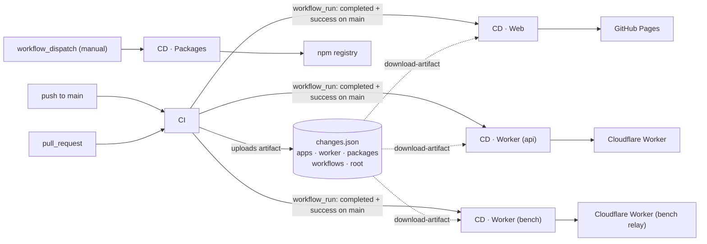
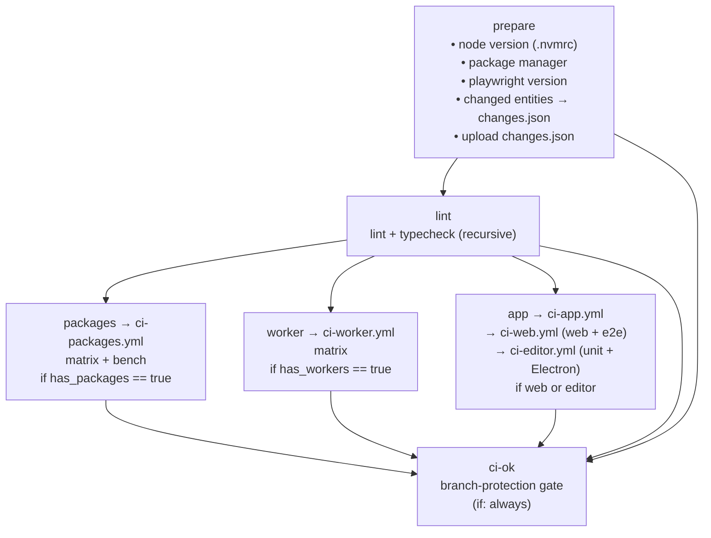
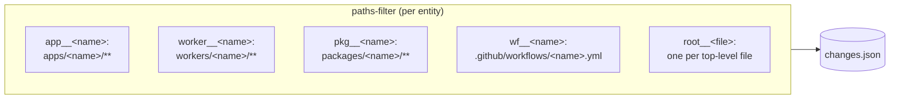
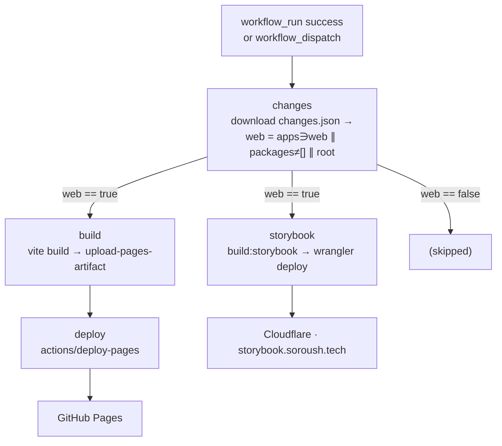
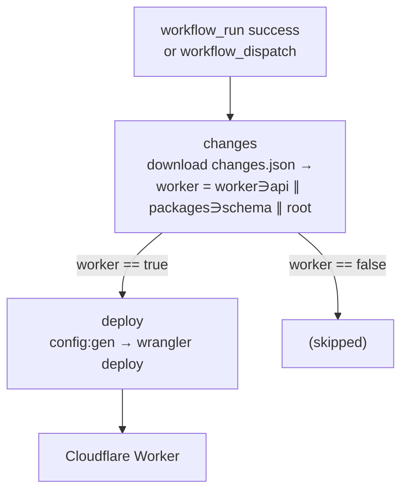
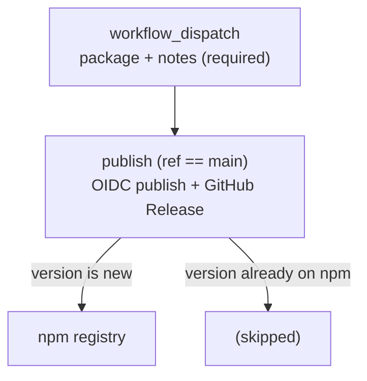

# GitHub Actions workflows

This directory holds the CI/CD pipeline for the `soroush.tech` monorepo. The CI
entry workflow calls **four** area workflows (packages, workers, web, editor), and there are **five** deployment workflows, a main-only
Chromatic visual-review workflow, and an issue-labeling automation. The three deploys
(`cd-web`, `cd-worker-api`, `cd-worker-bench`) are gated on CI success and never run off a
raw `push`; package publishing (`cd-packages`) and the editor release (`cd-editor`) are
**manual `workflow_dispatch` only**.

| File                                           | Name                           | Trigger                                                      |
| ---------------------------------------------- | ------------------------------ | ------------------------------------------------------------ |
| [`ci.yml`](./ci.yml)                           | `CI`                           | `push` to `main`, every `pull_request`                       |
| [`ci-packages.yml`](./ci-packages.yml)         | `CI · Packages`                | `workflow_call` from `ci.yml`                                |
| [`ci-worker.yml`](./ci-worker.yml)             | `CI · Workers`                 | `workflow_call` from `ci.yml`                                |
| [`ci-app.yml`](./ci-app.yml)                   | `CI · Apps`                    | `workflow_call` from `ci.yml`                                |
| [`ci-web.yml`](./ci-web.yml)                   | `CI · Web`                     | `workflow_call` from `ci-app.yml`                            |
| [`ci-editor.yml`](./ci-editor.yml)             | `CI · Editor`                  | `workflow_call` from `ci-app.yml`                            |
| [`cd-web.yml`](./cd-web.yml)                   | `CD · Web (Pages + Storybook)` | `workflow_run` of CI (success, `main`) + `workflow_dispatch` |
| [`cd-worker-api.yml`](./cd-worker-api.yml)     | `CD · Worker (api)`            | `workflow_run` of CI (success, `main`) + `workflow_dispatch` |
| [`cd-worker-bench.yml`](./cd-worker-bench.yml) | `CD · Worker (bench)`          | `workflow_run` of CI (success, `main`) + `workflow_dispatch` |
| [`cd-packages.yml`](./cd-packages.yml)         | `CD · Packages (npm)`          | manual `workflow_dispatch` only                              |
| [`cd-editor.yml`](./cd-editor.yml)             | `CD · Editor (release)`        | manual `workflow_dispatch` only                              |
| [`chromatic.yml`](./chromatic.yml)             | `Chromatic`                    | `push` to `main` (paths) + `workflow_dispatch`               |
| [`label-area.yml`](./label-area.yml)           | `Label Affected Area`          | `issues` `opened`                                            |

Names are `CI · <Area>` and `CD · <Area>`, so the Actions sidebar groups into two blocks - the
entry workflow is plain `CI`. Chromatic and the labeller are unprefixed because neither is part of
`ci-ok`. **Renaming one is never a one-file edit**: `workflow_run` matches on the `name:`, not the
filename, so the three deploys pin `workflows: ['CI']` and a rename that misses one stops that
deploy without a word. Branch protection matches the job name `ci-ok`, so it is unaffected.

Everything shared by the jobs that install - pnpm, Node, the install itself - is the composite
action [`.github/actions/setup`](../actions/setup/action.yml), called by every one of them.
**A new job starts from a checkout and a call to it**, so bumping the `pnpm/action-setup` pin
or changing the store cache is an edit to one file: see
[the setup action](./ci.md#the-setup-action).

**Per-workflow deep dives** (every step + caching):
[`ci.md`](./ci.md) · [`ci-packages.md`](./ci-packages.md) · [`ci-worker.md`](./ci-worker.md) · [`ci-app.md`](./ci-app.md) · [`ci-web.md`](./ci-web.md) · [`ci-editor.md`](./ci-editor.md) · [`cd-web.md`](./cd-web.md) · [`cd-worker-api.md`](./cd-worker-api.md) · [`cd-worker-bench.md`](./cd-worker-bench.md) · [`cd-packages.md`](./cd-packages.md) · [`cd-editor.md`](./cd-editor.md) · [`chromatic.md`](./chromatic.md) · [`label-area.md`](./label-area.md)

## How the pieces fit together

CI runs on every push/PR. On a successful `main` run it uploads a single
[`changes.json`](./ci.md#changesjson) artifact; the **deploy** workflows then start via
`workflow_run`, download it, and each applies its **own condition** to decide whether to
deploy. `cd-packages` is separate - it's triggered by hand, not by CI, so it reads no
artifact.

Why an artifact? A `workflow_run` event carries no diff base of its own, so the deploy
workflows can't compute what changed. CI already computed it against
`github.event.before..after`, records the answer in `changes.json`, and hands it off
through the artifact. Each deploy reads the file and applies its own condition (e.g. web
deploys on `apps`/`packages`/`root`); the policy lives in CD, the facts in CI. If the
artifact is missing (e.g. a manual `workflow_dispatch`), the deploy falls back to
deploying.

## `ci.yml` - CI

A single `prepare` job detects everything once and exposes it as outputs; the heavy
jobs fan out from it and are **gated by change detection** so a package-only PR never
spins up the tri-OS web suite. `ci-ok` is the one stable status check used for branch
protection - it tolerates change-gated jobs being skipped and fails only if a needed
job actually failed or was cancelled.

### `prepare` outputs

Detect once, reuse via `needs.prepare.outputs.*` - node version is always read from
`.nvmrc`, never hard-coded.

| Output                              | Source                                                                                          |
| ----------------------------------- | ----------------------------------------------------------------------------------------------- |
| `node_version`                      | `.nvmrc`                                                                                        |
| `manager` / `command` / `runner`    | presence of `pnpm-lock.yaml` / `yarn.lock` / etc.                                               |
| `playwright_version`                | `@playwright/test` version in `apps/web/package.json` (used in the Playwright binary cache key) |
| `web` / `editor`                    | derived booleans: the app, a package it declares, or infra changed                              |
| `has_packages` / `changed_packages` | the package matrix passed to `ci-packages.yml`                                                  |
| `has_workers` / `changed_workers`   | the worker matrix passed to `ci-worker.yml`                                                     |

CI also writes the [`changes.json`](./ci.md#changesjson) artifact the CD side reads.

### Change detection

A per-entity `dorny/paths-filter` config is generated from the workspace: one key per
app, worker, package, and workflow file, plus one **per root file** (top-level files only).
The matched keys become the `changes.json` lists. Dependency and infra policy is **not**
baked into the filters - it lives in each consumer's condition (CI gating in
`prepare`, deploy/publish gating in each CD workflow).

Two rules keep a run to what it is about, both in
[`scripts/assemble-changes.mjs`](../../scripts/assemble-changes.mjs):

- **Who runs is derived from the tree**, not listed. A member runs when it changed or when a
  package it declares as a `workspace:` dependency changed, so `packages/schema` runs the web app
  and the API worker that share it - and nothing else.
- **A workflow file validates what it runs**, declared on its own line 1 as `# ci:validates ...`:
  `all` for `ci.yml`, `pkg__*` for the package workflow, `app__web` for the web one, `nothing` for a
  deploy CI never executes. No table kept elsewhere - the scope sits beside the jobs it describes,
  and an unmarked or unparseable claim means the whole workspace, so a new file can only over-run.

### The `web` and `e2e` jobs

**`web`** runs on **ubuntu only**. It builds (Codecov bundle analysis) and runs a merged
`test:coverage` pass (unit + browser + storybook in one V8 pass) uploaded as the authoritative
`web` flag that patch gates on, plus the three per-tier runs for their informational
`unit`/`browser`/`storybook` flags. Chromatic visual review is **not** here - it runs in its
own main-only [`chromatic.yml`](./chromatic.yml).

**`e2e`** is the only multi-OS job: a matrix running each Playwright engine on its native
platform (macOS ~10× cost - WebKit only). It `needs: web`, so a `web` failure skips `e2e`. Only
the chromium row runs with coverage and uploads the `e2e` flag; Playwright's `webServer`
builds/serves the app, so there is no separate build step.

| Job / Step                                         | ubuntu | windows | macOS |
| -------------------------------------------------- | :----: | :-----: | :---: |
| **packages / worker** - one row per changed member |   ✅   |         |       |
| **web** - build + unit/browser/storybook coverage  |   ✅   |         |       |
| **e2e** Chromium (+ coverage)                      |   ✅   |         |       |
| **e2e** Firefox                                    |        |   ✅    |       |
| **e2e** WebKit                                     |        |         |  ✅   |
| **editor** - unit tier + Electron under xvfb       |   ✅   |         |       |

The Playwright browser binaries are cached by `runner.os` + Playwright version, with a
fixed `PLAYWRIGHT_BROWSERS_PATH`; `web` and the `e2e` chromium row share the ubuntu cache.

### Coverage → Codecov

Each workspace emits its own `coverage/lcov.info` and uploads under its own **flag**;
Codecov merges uploads by commit SHA. 100% coverage is enforced inside each
`vitest.config` - Codecov is for reporting, not the gate.

| Flag                 | Source                            |
| -------------------- | --------------------------------- |
| `<member>` (per row) | `<area>/<dir>/coverage/lcov.info` |
| `api`                | `workers/api` (a matrix row)      |
| `bench-api`          | `workers/bench` (a matrix row)    |
| `editor`             | editor unit tier (a matrix row)   |
| `editor-e2e`         | editor Playwright-Electron        |
| `unit`               | web unit (jsdom)                  |
| `browser`            | web browser-mode unit             |
| `storybook`          | Storybook test runner             |
| `e2e`                | web Playwright (`coverage/e2e`)   |

## `cd-web.yml` - CD · Web (Pages + Storybook)

`concurrency: pages` with `cancel-in-progress: false` so deploys queue rather than
abort each other. Build env (Vite vars, GitHub key, Turnstile sitekey) is injected
from repo secrets/vars; `APP_ENV=production`.

## `cd-worker-api.yml` - CD · Worker (api)

`config:gen` renders `wrangler.json` from repo `vars` (worker name, D1, R2, honeypot);
`wrangler deploy` authenticates with `CLOUDFLARE_API_TOKEN` + `CLOUDFLARE_ACCOUNT_ID`.

## `cd-worker-bench.yml` - CD · Worker (bench)

Structural mirror of `cd-worker-api.yml` for `workers/bench` (the bench-action comment
relay at `api.bench.soroush.tech`): deploys when
`worker∋bench ∥ packages∋wrangler-tools ∥ root`, in its own
`cd-worker-bench` environment - see [`cd-worker-bench.md`](./cd-worker-bench.md).

## `cd-packages.yml` - CD · Packages (npm)

**Manual only** - unlike the other two CD workflows, this one is **not** gated on CI and
never runs off a push, PR merge, or `workflow_run`. It publishes from `workflow_dispatch`,
taking a `package` (choice) and **required** `notes` input.

Publishes the chosen non-`private` package to npm via **Trusted Publishing (OIDC)** - no
long-lived `NPM_TOKEN`; GitHub mints a short-lived id-token per run that npm verifies
against the package's trusted publisher. The publish step skips a version already on the
registry, so **a release is just bumping `package.json` `version` on `main`, then
dispatching**. On a real publish it cuts a GitHub Release tagged `<pkg>@<version>` whose
notes are the **required `notes` input** - no PR or changelog is read. Auto-publish on
merge and required human-written notes can't coexist, so publishing is a deliberate,
on-demand step. See [cd-packages.md](./cd-packages.md) for the full walkthrough.

## Conventions (see the `ci-cd` skill)

- Detect node/package-manager once in `prepare`; reuse via outputs.
- Gate heavy jobs on `dorny/paths-filter` change detection; wire dependency edges by hand.
- `timeout-minutes` on every job; `fail-fast: false` on matrices.
- `cancel-in-progress: true` on CI; **`false`** on the deploy workflows.
- Secrets → `secrets`; non-sensitive config (URLs/IDs/names) → `vars`.
- ubuntu-only except the browser/E2E suite (tri-OS).
