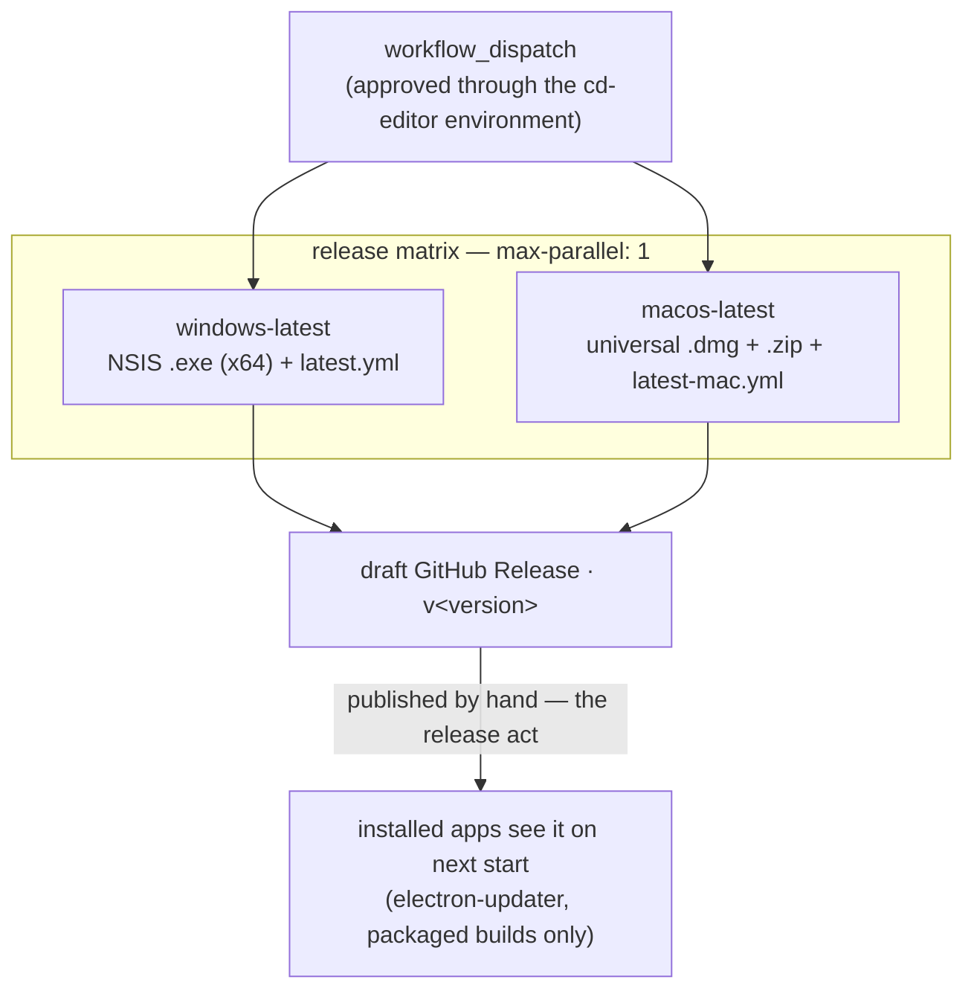

[← Workflows overview](./README.md)

# `cd-editor.yml` — Package and release the desktop editor

Builds the editor's installers and uploads them to a **draft GitHub Release**.
Manual `workflow_dispatch` only — a release is a decision, not a side effect of
a merge. The release job runs only when dispatched from `main`
(`if: github.ref == 'refs/heads/main'`), so it always builds a line CI has
already validated.

```yaml
on:
  workflow_dispatch:
concurrency:
  group: cd-editor
  cancel-in-progress: false # never abort an in-flight release build
```

---

## Job graph



---

## Job: `release`

Matrix over `windows-latest` + `macos-latest`, `max-parallel: 1` (both legs
write into the same draft release — two creating it at once is two drafts).
`environment: cd-editor` · `timeout-minutes: 30` · `permissions: contents: write`.

Each leg: checkout → node via `.nvmrc` → `pnpm install --frozen-lockfile
--ignore-scripts` (no lifecycle script is needed: electron-builder downloads
its own Electron for packaging) → `pnpm --filter @soroush/editor release`
(`electron-vite build && electron-builder --publish always`). Packaging config
lives in `apps/editor/electron-builder.yml`; the bundles in `out/` carry every
dependency, so no `node_modules` ship.

| Leg     | Artifacts                                      | Signing                                                                      |
| ------- | ---------------------------------------------- | ---------------------------------------------------------------------------- |
| Windows | NSIS `.exe` (x64) + `latest.yml` + blockmap    | Unsigned for now — SmartScreen warns until a signature or reputation arrives |
| macOS   | `.dmg` + `.zip` (universal) + `latest-mac.yml` | **Unsigned for now** — no Apple Developer account yet (see below)            |

The macOS zip is not optional: macOS auto-update only consumes zips — the dmg
is for people. While the macOS build is unsigned, Gatekeeper only opens it via
right-click → Open, and **macOS auto-update stays off** (Squirrel refuses
unsigned apps); the Windows leg auto-updates regardless. The `cd-editor`
environment currently holds no values — it exists as the approval gate.

### When the Apple Developer account exists

Restore signing in two places — nothing else moves:

1. `apps/editor/electron-builder.yml`: delete `mac.identity: null`, set
   `mac.notarize: true`.
2. `cd-editor.yml`: give the macOS leg electron-builder's standard
   code-signing and notarization environment (the Developer ID certificate
   and an App Store Connect API key — see electron-builder's code-signing
   docs for the variable set), with the values stored in the `cd-editor`
   GitHub environment. Keep that env scoped to the macOS leg only — a
   signing certificate visible to the Windows leg would be pulled into a
   Windows signing attempt.

## Releasing

1. Bump `apps/editor/package.json` `version` on a branch, merge to `main`.
2. Dispatch this workflow; approve the `cd-editor` environment gate.
3. Both legs upload into one draft release tagged `v<version>` (the plain `v*`
   namespace is the editor's — packages tag as `@soroush.tech/name@x.y.z`).
4. Review the draft on GitHub and publish it. **Publishing is the release
   act**: installed apps check the newest published release's `latest*.yml`
   on startup (`src/main/updater.ts`, packaged builds only) and update in the
   background.

---

See also: [ci-editor.md](./ci-editor.md) and the [overview README](./README.md).
