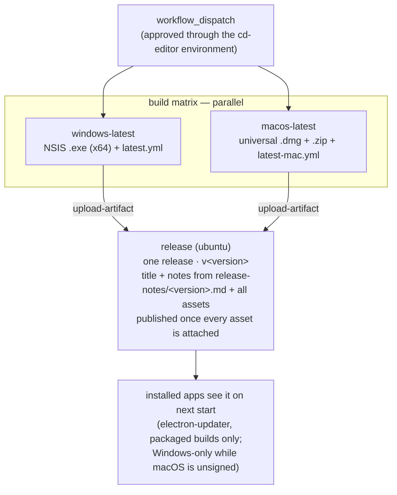

[← Workflows overview](./README.md)

# `cd-editor.yml` — Package and release the desktop editor

Builds the editor's installers on both platforms and assembles them into **one
published GitHub Release** with a title and the notes from
`apps/editor/release-notes/<version>.md`. Manual
`workflow_dispatch` only — a release is a decision, not a side effect of a
merge, and **approving the dispatch is the release act**. The build job runs
only when dispatched from `main` (`if: github.ref == 'refs/heads/main'`), so
it always builds a line CI has already validated.

```yaml
on:
  workflow_dispatch:
concurrency:
  group: cd-editor
  cancel-in-progress: false # never abort an in-flight release build
```

---

## Job graph



---

## Job: `build`

Matrix over `windows-latest` + `macos-latest`, genuinely parallel — the legs no
longer share a draft release, so there is nothing to serialize.
`environment: cd-editor` · `timeout-minutes: 30`.

Each leg: checkout → node via `.nvmrc` → `pnpm install --frozen-lockfile
--ignore-scripts` (no lifecycle script is needed: electron-builder downloads
its own Electron for packaging) → `pnpm --filter @soroush/editor dist`
(`electron-vite build && electron-builder --publish never`) → upload the
installers, blockmaps and `latest*.yml` manifests as an `editor-<OS>`
artifact (`if-no-files-found: error`; the unpacked app directories stay
behind). Packaging config lives in `apps/editor/electron-builder.yml`; the
bundles in `out/` carry every dependency, so no `node_modules` ship. The app
icon is generated from `apps/editor/build/icon.png` (the brand mark from
`apps/web/public/soroush.svg` on the favicon's dark background) —
electron-builder derives the `.icns` and `.ico` from it.

| Leg     | Artifacts                                      | Signing                                                                      |
| ------- | ---------------------------------------------- | ---------------------------------------------------------------------------- |
| Windows | NSIS `.exe` (x64) + `latest.yml` + blockmap    | Unsigned for now — SmartScreen warns until a signature or reputation arrives |
| macOS   | `.dmg` + `.zip` (universal) + `latest-mac.yml` | **Unsigned for now** — no Apple Developer account yet (see below)            |

The macOS zip is not optional: macOS auto-update only consumes zips — the dmg
is for people. While the macOS build is unsigned, Gatekeeper only opens it via
right-click → Open, and **macOS auto-update stays off** (Squirrel refuses
unsigned apps); the Windows leg auto-updates regardless. The `cd-editor`
environment currently holds no values — it exists as the approval gate.

## Job: `release`

`needs: build` · `ubuntu-latest` · `timeout-minutes: 10` ·
`permissions: contents: write`. Checkout with `fetch-tags: true` (the previous
`v*` tag anchors the notes range), download both artifacts
(`merge-multiple: true`), then one `gh release create`:

- **Tag** `v<version>` from `apps/editor/package.json` — the plain `v*`
  namespace is the editor's; packages tag as `@soroush.tech/name@x.y.z`.
- **Title** `Soroush Editor v<version>`.
- **Notes** read verbatim (`--notes-file`) from the in-repo
  `apps/editor/release-notes/<version>.md`, exactly like package releases
  (see the release-notes skill). The job fails without the file, and
  `pnpm check:release-notes` (pre-commit + CI lint) catches the gap earlier —
  a version bump can't land on `main` without its notes.
- **Assets**: both legs' installers, blockmaps and `latest*.yml`.

The release is created as a draft and flipped to published only once every
asset is attached — electron-updater reads the newest published release, and
it must never see one whose `latest*.yml` or installers are still uploading.

Re-run safe: a leftover **draft** (from a run that failed before publishing)
is deleted and recreated; a **published** tag fails the job — that version has
shipped, bump the version instead.

### When the Apple Developer account exists

Restore signing in two places — nothing else moves:

1. `apps/editor/electron-builder.yml`: delete `mac.identity: null`, set
   `mac.notarize: true`.
2. `cd-editor.yml`: give the macOS build leg electron-builder's standard
   code-signing and notarization environment (the Developer ID certificate
   and an App Store Connect API key — see electron-builder's code-signing
   docs for the variable set), with the values stored in the `cd-editor`
   GitHub environment. Keep that env scoped to the macOS leg only — a
   signing certificate visible to the Windows leg would be pulled into a
   Windows signing attempt.

## Releasing

1. In one PR to `main`: bump `apps/editor/package.json` `version` **and** add
   `apps/editor/release-notes/<version>.md` with the notes
   (`pnpm check:release-notes` fails the commit without it).
2. Dispatch this workflow; approve the `cd-editor` environment gate. **That
   approval is the release act** — nothing after it waits on a human.
3. Both legs build in parallel; the `release` job assembles one release tagged
   `v<version>` with title, the notes file's contents and all assets, and
   publishes it. From that moment installed apps check its `latest*.yml` on
   startup (`src/main/updater.ts`, packaged builds only) and update in the
   background — Windows only while the macOS build is unsigned (see above).

---

See also: [ci-editor.md](./ci-editor.md) and the [overview README](./README.md).
