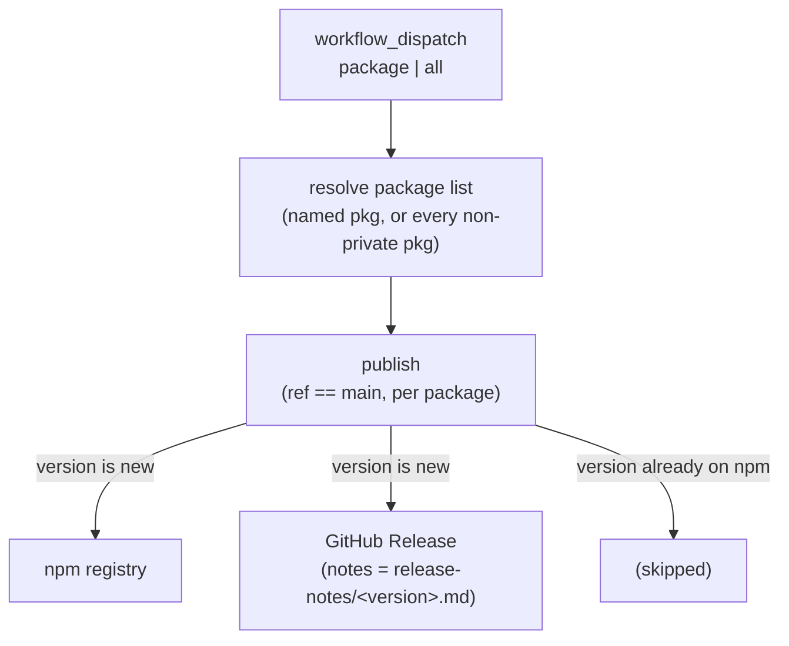

[← Workflows overview](./README.md)

# `cd-packages.yml` — Publish Packages (npm)

Publishes `@soroush.tech/*` packages to npm via **Trusted Publishing (OIDC)** —
no long-lived `NPM_TOKEN`. The dispatch picks either a single package or **`all`**: every
non-private package whose current `package.json` version isn't on the registry yet, so one
run can release everything pending after a version-bump PR lands. **Manual only:** it runs
from `workflow_dispatch`, never from a push, PR merge, or CI completion. A release is a
deliberate act, and its GitHub Release notes are read from a **required in-repo file**
(`release-notes/<version>.md`) — so a package never ships with empty notes.

```yaml
on:
  workflow_dispatch:
    inputs:
      package: # which package to publish, or `all`
        required: true
        type: choice
        options: [all, bench, playwright-coverage, styled-system, vite-plugin-msw-server] # generated — see below
concurrency:
  group: publish-packages
  cancel-in-progress: false
```

| Field       | Value                                                                 |
| ----------- | --------------------------------------------------------------------- |
| Triggers    | manual `workflow_dispatch` only (no push / PR / CI trigger)           |
| Inputs      | `package` (choice, required): a package or `all` — notes read in-repo |
| Concurrency | one `publish-packages` run at a time; queued, not cancelled           |

**Why manual?** Publishing is an explicit, on-demand step rather than a side effect of a
merge — the version bump and its release-notes file land in the repo first (via a normal
PR), then a human dispatches the release deliberately.

---

## Job graph



---

## Job: `publish`

`if: github.ref == 'refs/heads/main'` · `environment: cd-packages` · ubuntu · 15 min.
Runs for the package list the dispatch resolves to — the one named package, or (for `all`)
every non-private package. One job, one environment approval; the publish and release steps
loop over the list.

```yaml
permissions:
  id-token: write # OIDC token for npm Trusted Publishing (no NPM_TOKEN)
  contents: write # create the GitHub Release + tag
```

| #   | Step                 | Detail                                                                                                                                                                                                                                                                                                                                                                                                                                                                                                                              |
| --- | -------------------- | ----------------------------------------------------------------------------------------------------------------------------------------------------------------------------------------------------------------------------------------------------------------------------------------------------------------------------------------------------------------------------------------------------------------------------------------------------------------------------------------------------------------------------------- |
| 1   | Checkout             | `actions/checkout@v5`, no persisted creds                                                                                                                                                                                                                                                                                                                                                                                                                                                                                           |
| 2   | Resolve packages     | Turns `inputs.package` (read via `$PKG` env, never spliced into shell) into the run's package list (`$PKGS` via `GITHUB_ENV`): the one named package — which must exist under `packages/` and be non-`private` (defense-in-depth in case the generated choice list is hand-edited) — or, for `all`, every non-private directory under `packages/`. Every resolved package must have a `release-notes/<version>.md` for its current `package.json` version. Runs before publish, so npm is never touched when any notes are missing. |
| 3   | Read Node.js version | `cat .nvmrc` → `$GITHUB_ENV` (`NODE_VERSION`)                                                                                                                                                                                                                                                                                                                                                                                                                                                                                       |
| 4   | Setup pnpm           | `pnpm/action-setup@v5`                                                                                                                                                                                                                                                                                                                                                                                                                                                                                                              |
| 5   | Setup Node           | `actions/setup-node@v5`, `node-version: $NODE_VERSION`, `cache: pnpm` (deps cache), `registry-url: https://registry.npmjs.org`                                                                                                                                                                                                                                                                                                                                                                                                      |
| 6   | Install              | `pnpm install --frozen-lockfile`                                                                                                                                                                                                                                                                                                                                                                                                                                                                                                    |
| 7   | **Publish**          | Loops `$PKGS`: per package, `pnpm publish --no-git-checks`, guarded by an `npm view` check that skips a version already on the registry — with `all`, that skip **is** the filter: only packages with an unpublished version actually ship. A real publish failure is recorded but doesn't abort the loop — the remaining packages still publish, then the step fails listing the failed ones. Auth is the OIDC id-token; **`NODE_AUTH_TOKEN` is never set**. Writes a job-summary line per package (published or skipped).         |
| 8   | **GitHub Release**   | Loops `$PKGS` and runs even when Publish failed (`!cancelled()`), so packages that did publish still get their Release. Per package: skips a version that isn't on npm (no Release for a failed publish), then creates the Release only if it doesn't already exist (`gh release view` check) — gated on the release's existence, not the npm-publish path, so a rerun can repair a missing release after a successful publish. Runs `gh release create "<name>@<version>" --notes-file packages/<pkg>/release-notes/<version>.md`. |

The dispatch is restricted to `main` (`github.ref`), so a release always comes off the
CI-passed main branch, even though the dispatch UI lets you pick any ref.

---

## Trusted Publishing (OIDC)

Auth is [npm Trusted Publishing](https://docs.npmjs.com/trusted-publishers) — no
`NPM_TOKEN` anywhere. Per run, GitHub mints a short-lived id-token (the
`id-token: write` permission) and npm verifies it against the package's trusted
publisher (repo `soroush-tech/core`, workflow `cd-packages.yml`, environment
`cd-packages`). Requirements / gotchas:

- **One-time bootstrap:** a package must exist on npm before a trusted publisher can be
  configured for it, so the **first** publish of a new name is manual (`npm publish`),
  then OIDC takes over.
- **pnpm version:** publish on **pnpm 10.x** (the repo pins `pnpm@10.13.1`) — OIDC is
  currently broken on pnpm 11 ([pnpm#11513](https://github.com/pnpm/pnpm/issues/11513)).
  Needs a modern Node runtime; the repo runs **Node 25** (`.nvmrc`).
- **Never set `NODE_AUTH_TOKEN`:** an empty value makes pnpm attempt token auth instead
  of falling back to OIDC.
- **Release = version bump:** the publish step skips versions already on the registry,
  so a release is just bumping `package.json` `version` on `main`, then dispatching —
  and dispatching `all` releases every package with a pending bump in one run.

---

## Release notes (in-repo file)

The GitHub Release notes come from a versioned file **committed to the package**:
`packages/<pkg>/release-notes/<version>.md`, where `<version>` matches `package.json`. No
dispatch input, no changelog aggregation, no commit parsing — you write the notes in the same
PR that bumps the version, and they live in the repo as a browsable per-package history.

The Validate step (before publish) requires the file to exist for the current version, so a
release can never be cut with empty notes and npm is never touched when they're missing. The
same invariant is caught earlier by `pnpm check:release-notes`
(`scripts/check-release-notes.mjs`): the **husky `pre-commit` hook** and the CI **lint** job
both fail when a non-`private` package's `package.json` version has no matching
`release-notes/<version>.md` — so a version bump can't even land on `main` without its notes. The
Release step then tags `<package-name>@<version>` (package-scoped so multiple packages don't
collide on a plain `v<version>`) when one doesn't already exist — so a rerun can repair a
missing release — and reads the file verbatim:

```sh
gh release create "<name>@<version>" --title "<name>@<version>" \
  --notes-file "packages/<pkg>/release-notes/<version>.md"
```

**Notes files never ship to npm:** every package uses a `files` allowlist (`["dist"]`), so
the tarball carries only `dist`, `package.json`, `README`, and `LICENSE` — `release-notes/`
is excluded automatically (no `.npmignore` needed). **npm itself has no release-notes field**
— the in-repo directory is the canonical home, the GitHub Release mirrors it, and each package
README links to its `release-notes/` directory.

---

## The `package` choice list

`workflow_dispatch` `choice` options must be literal YAML — GitHub can't populate them from
the repo at dispatch time — so the list is **generated**, not hand-maintained. Between the
`# gen:publish-options start` / `end` markers, `scripts/gen-publish-options.mjs` writes an
`all` entry first (a mode, not a package — the workflow expands it at run time), then every
non-`private` package under `packages/`, sorted. Regenerate after adding, removing, or
un-`private`-ing a package:

```sh
pnpm gen:publish-options   # rewrites the options block; commit the result
```

The **husky `pre-commit` hook** runs `pnpm gen:publish-options --check` and fails the commit
if the list is stale — so a package can't be added to `packages/` without its dropdown entry
landing in the same change. This is enforced at commit time, not in the workflow: an unlisted
package simply can't be dispatched, and re-checking a listed one during publish would only
catch drift that publishing can't act on.

## Releasing a package

1. In one PR to `main` (CI runs): bump the package `version` in `package.json` **and** add
   `packages/<dir>/release-notes/<version>.md` with that version's notes — for as many
   packages as the PR releases.
2. Actions → **Publish Packages (npm)** → **Run workflow** → pick the `package` (or `all`
   to release every package with a pending bump), **Run**.
   CLI equivalent: `gh workflow run cd-packages.yml -f package=<dir|all>`.
3. The job publishes each resolved package to npm (skipping any version already there) and
   cuts the per-package GitHub Release from its notes file.

---

## Caching

Only the **dependency store**, via `setup-node@v5` with `cache: pnpm` — keyed off the
`pnpm-lock.yaml` hash, same mechanism as CI.

---

See also: [ci.md](./ci.md), [cd-web.md](./cd-web.md), [cd-worker-api.md](./cd-worker-api.md),
and the [overview README](./README.md).
