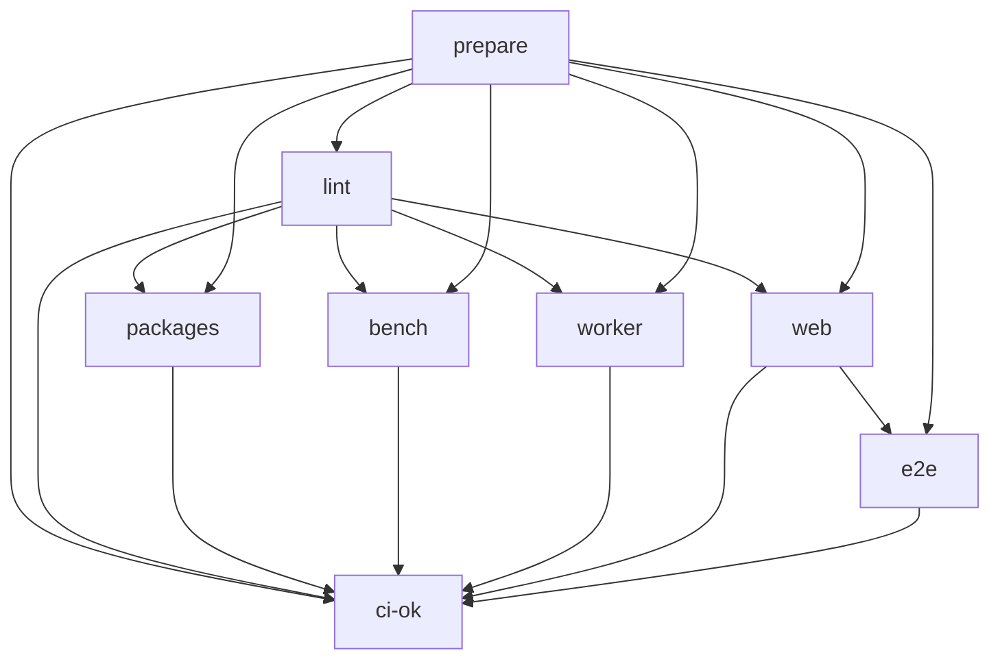

[← Workflows overview](./README.md)

# `ci.yml` — Continuous Integration

Single CI workflow for the whole monorepo. A `prepare` job detects everything once,
then change-gated jobs fan out from it. `ci-ok` is the single status check used for
branch protection.

```yaml
on:
  push: { branches: [main] }
  pull_request:
permissions: { contents: read }
concurrency:
  group: ${{ github.workflow }}-${{ github.ref }}
  cancel-in-progress: true # supersede stale runs on the same ref
```

| Field       | Value                                                          |
| ----------- | -------------------------------------------------------------- |
| Triggers    | `push` to `main`, every `pull_request`                         |
| Permissions | `contents: read` (least privilege; jobs that need more opt in) |
| Concurrency | one run per `workflow + ref`; in-progress runs are cancelled   |

---

## Job graph



`packages`, `bench`, `worker`, `web`, and `e2e` only run when their area changed
(see [`prepare`](#job-prepare)). `ci-ok` runs `if: always()` so it can turn skips
into a pass and real failures into a fail.

---

## Job: `prepare`

`runs-on: ubuntu-latest` · `timeout-minutes: 15`. Produces every output the other
jobs consume via `needs.prepare.outputs.*`.

| #   | Step                        | Run / Action                                                                                                           | What it does                                                                                                                                                                                                                               |
| --- | --------------------------- | ---------------------------------------------------------------------------------------------------------------------- | ------------------------------------------------------------------------------------------------------------------------------------------------------------------------------------------------------------------------------------------ |
| 1   | Checkout Repository         | `actions/checkout@v5` (`persist-credentials: false`)                                                                   | Clone the repo without leaving the token on disk.                                                                                                                                                                                          |
| 2   | Read Node.js version        | `cat .nvmrc` → `$GITHUB_OUTPUT`                                                                                        | Single source of truth for the Node version; never hard-coded.                                                                                                                                                                             |
| 3   | Detect package manager      | shell `if` on lockfile presence                                                                                        | Emits `manager` (`pnpm`/`yarn`/`npm`), `command` (e.g. `install --frozen-lockfile`), `runner`. Fails if none found.                                                                                                                        |
| 4   | Read Playwright version     | `node -p "...devDependencies?.['@playwright/test'] \|\| ...dependencies?.['@playwright/test']"` then strip leading `^` | Feeds the Playwright binary cache key. **Must read `@playwright/test`** — the project has no bare `playwright` dep, so reading `playwright` yields the string `"undefined"` and freezes the cache key (see [Caching](#caching)).           |
| 5   | Discover workspace entities | inline `node` script over `apps/*`, `workers/*`, `packages/*`, `.github/workflows/*`                                   | Builds a per-entity `paths-filter` config: one key per app (`app__<name>`), worker (`worker__<name>`), package (`pkg__<name>`), and workflow file (`wf__<name>`), plus `root` (`['*', '.*']`, top-level files only).                       |
| 6   | Detect changed entities     | `dorny/paths-filter@v4`                                                                                                | Consumes the generated `filters` (JSON is valid YAML) and outputs a `changes` list of the keys that matched.                                                                                                                               |
| 7   | Assemble `changes.json`     | inline `node` script                                                                                                   | Writes [`changes.json`](#changesjson) (the lists + `root`), and derives this run's own gating outputs `web` / `worker` / `has_packages` / `changed_packages`. A `root` or workflow change counts as infra → validates the whole workspace. |
| 8   | Upload `changes.json`       | `actions/upload-artifact@v7` (name `changes`)                                                                          | Hands the single file to the CD workflows, which run on `workflow_run` and have no diff base of their own.                                                                                                                                 |

### Outputs

| Output                           | Meaning                                                                                    |
| -------------------------------- | ------------------------------------------------------------------------------------------ |
| `node_version`                   | from `.nvmrc`                                                                              |
| `manager` / `command` / `runner` | package-manager triple                                                                     |
| `playwright_version`             | `@playwright/test` semver (cache key input)                                                |
| `web` / `worker`                 | `'true'` when that area, a dep it bundles, or infra changed                                |
| `has_packages`                   | `'true'` when ≥1 package (or infra) changed                                                |
| `changed_packages`               | `fromJSON`-ready matrix `{include:[{dir,filter,flag,browsers}]}` for the CI `packages` job |

### `changes.json`

The single artifact the CD workflows consume. `apps` / `worker` / `packages` /
`workflows` are **lists of the changed names** (empty when nothing changed); `root`
is a **boolean** (a top-level file changed). No `dir`/`filter`/`flag` — a name is
enough; each CD applies its own [condition](./cd-web.md#job-changes).

```json
{
  "apps": ["web"],
  "worker": ["api"],
  "packages": ["schema", "eslint-config"],
  "workflows": ["ci", "cd-web"],
  "root": false
}
```

---

## Job: `lint`

`needs: prepare` · ubuntu · 15 min. Lint + typecheck the whole workspace once
(`pnpm -r` skips workspaces without the script). Not change-gated — it's cheap.

| #   | Step       | Detail                                                                                                               |
| --- | ---------- | -------------------------------------------------------------------------------------------------------------------- |
| 1   | Checkout   | `actions/checkout@v5`, no persisted creds                                                                            |
| 2   | Setup pnpm | `pnpm/action-setup@v5`, only `if manager == 'pnpm'`                                                                  |
| 3   | Setup Node | `actions/setup-node@v5` with `node-version: <prepare>` and `cache: <manager>` (deps cache — see [Caching](#caching)) |
| 4   | Install    | `${manager} ${command}` with `CI: true`                                                                              |
| 5   | Lint       | `${runner} run lint` (`--max-warnings 0`)                                                                            |
| 6   | Typecheck  | `${runner} run typecheck`                                                                                            |

---

## Job: `packages`

`needs: [prepare, lint]` · `if: has_packages == 'true'` · `environment: CI` · ubuntu ·
15 min. Runs once per changed package via the matrix.

```yaml
strategy:
  fail-fast: false # one package failing doesn't cancel the others
  matrix: ${{ fromJSON(needs.prepare.outputs.changed_packages) }}
```

| #   | Step                                                      | Detail                                                                                                             |
| --- | --------------------------------------------------------- | ------------------------------------------------------------------------------------------------------------------ |
| 1–4 | Checkout · Setup pnpm · Setup Node (deps cache) · Install | same shape as `lint`                                                                                               |
| 5   | Playwright cache/install (browser-tier rows only)         | gated on `matrix.browsers`; same restore → install → save shape and cache key as the `web` job                     |
| 6   | Tests with coverage                                       | `${runner} --filter ${{ matrix.filter }} test:coverage`                                                            |
| 7   | Upload to Codecov                                         | `codecov/codecov-action@v7`, `files: ./packages/${{ matrix.dir }}/coverage/lcov.info`, `flags: ${{ matrix.flag }}` |

A matrix row sets `browsers: true` when the package declares `playwright` in its own
dependencies (assembled in `prepare`) — i.e. it has a real-browser vitest tier (e.g.
`design-system`'s `*.browser.test.*`). Only those rows pay for the Chromium install;
the job pins `PLAYWRIGHT_BROWSERS_PATH` so they share the `web`/`e2e` browser cache.

---

## Job: `bench`

`needs: [prepare, lint]` · `environment: CI` · ubuntu · 20 min. The performance
gate: runs `packages/styled-system/bench/*.bench.ts` in the pinned Docker
sandbox via the standalone
[`soroush-tech/bench-action`](https://github.com/soroush-tech/bench-action)
(own-org, so version-tagged `@v1` like `actions/*`) and fails when any case's speed
drops below **80%** of the `previous` baseline (the last
`@soroush.tech/styled-system` npm release, installed inside the sandbox via
the `latest` dist-tag). Results are upserted as one sticky PR comment.

Change-gated without its own filter: it runs when `styled-system` or `bench`
appears in `changed_packages` — and since a root/workflow change puts every
package in that matrix, infra changes (including edits to `ci.yml` itself,
e.g. changing the action pin) trigger it too.

```yaml
if: >-
  contains(fromJSON(needs.prepare.outputs.changed_packages).include.*.dir, 'styled-system') ||
  contains(fromJSON(needs.prepare.outputs.changed_packages).include.*.dir, 'bench')
```

| #   | Step                                                      | Detail                                                                                                 |
| --- | --------------------------------------------------------- | ------------------------------------------------------------------------------------------------------ |
| 1–4 | Checkout · Setup pnpm · Setup Node (deps cache) · Install | same shape as `lint`                                                                                   |
| 5   | Build styled-system                                       | the bench file imports the built dist, so the comparison against npm's prebuilt dist is fair           |
| 6   | Run benchmark gate                                        | `uses: soroush-tech/bench-action@v1` with `baseline-case: previous`, `min-ratio: '80'`, `GITHUB_TOKEN` |

The job needs `pull-requests: write` for the results comment; on a read-only
token the comment is skipped with a warning and only the gate decides the job.

---

## Job: `worker`

`needs: [prepare, lint]` · `if: worker == 'true'` · `environment: CI` · ubuntu · 15 min.

| #   | Step                                                      | Detail                                                               |
| --- | --------------------------------------------------------- | -------------------------------------------------------------------- |
| 1–4 | Checkout · Setup pnpm · Setup Node (deps cache) · Install | same shape as `lint`                                                 |
| 5   | Tests with coverage                                       | `${runner} --filter @soroush/api test:coverage`                      |
| 6   | Upload to Codecov                                         | `files: ./workers/api/coverage/lcov.info`, `flags: api`, `name: api` |

---

## Job: `web`

`needs: [prepare, lint]` · `if: web == 'true'` · `environment: CI` · **ubuntu** · 30 min.
Unit / browser / storybook coverage tiers. Browser engines (E2E) run in the separate
[`e2e`](#job-e2e) job. Exposes `outputs.vite_base_url` (the env-scoped `VITE_BASE_URL`) so the
environment-less `e2e` job can consume it.

```yaml
runs-on: ubuntu-latest
env:
  PLAYWRIGHT_BROWSERS_PATH: ${{ github.workspace }}/ms-playwright
```

`PLAYWRIGHT_BROWSERS_PATH` is pinned so the cache path/key is stable and shared with the
`e2e` job's chromium row on the same runner OS.

| #   | Step                            | Detail                                                                                                                                                                                                   |
| --- | ------------------------------- | -------------------------------------------------------------------------------------------------------------------------------------------------------------------------------------------------------- |
| 1   | Checkout                        | `fetch-depth: 0` (Codecov base detection), no persisted creds                                                                                                                                            |
| 2   | Setup pnpm                      | `if manager == 'pnpm'`                                                                                                                                                                                   |
| 3   | Setup Node                      | deps cache via `cache: <manager>`                                                                                                                                                                        |
| 4   | **Restore Playwright cache**    | id `playwright-cache`, key `${{ runner.os }}-playwright-${{ needs.prepare.outputs.playwright_version }}`                                                                                                 |
| 5   | Install                         | `${manager} ${command}`, `CI: true`                                                                                                                                                                      |
| 6   | Install Playwright browsers     | cache miss → `playwright install --with-deps chromium` (only Chromium — unit-browser + storybook run headless Chromium)                                                                                  |
| 7   | Install Playwright system deps  | cache hit → `playwright install-deps chromium` (apt libs only)                                                                                                                                           |
| 8   | **Save Playwright cache**       | `if: always() && cache-hit != 'true'`, same key                                                                                                                                                          |
| 9   | Build project                   | `${runner} run build` with `SKIP_PRERENDER: 'true'` (Codecov bundle analysis)                                                                                                                            |
| 10  | Web coverage (merged) → Codecov | `test:coverage` (unit + browser + storybook in one V8 pass) → upload `flags: web`; `.codecov.yml` gates patch on it. **Uploaded first** so the Codecov PR comment renders from this authoritative report |
| 11  | Unit coverage → Codecov         | `test:coverage:unit` → upload `flags: unit` (informational)                                                                                                                                              |
| 12  | Browser coverage → Codecov      | `test:coverage:browser` → upload `flags: browser` (informational)                                                                                                                                        |
| 13  | Storybook coverage → Codecov    | `test:coverage:storybook` → upload `flags: storybook` (informational). Self-hosts Storybook from `.storybook` (no external URL)                                                                          |

`web` is the single merged V8 pass that gates patch; the per-tier flags stay informational
(each runs `all: true`, so gating on them directly would surface phantom-uncovered lines). The
per-tier runs mean each tier executes twice — accepted so `web` never depends on Codecov's
same-flag merge. Visual review (Chromatic) is not here — it's a main-only, non-blocking
workflow; see [`chromatic.md`](./chromatic.md).

---

## Job: `e2e`

`needs: [prepare, lint, web]` · `if: web == 'true'` · **no `environment`** · 30 min. Depends on
`web`, so a `web` failure skips `e2e` (no point running the engines when the app's own suite is
red). One browser engine per native OS; macOS (≈10× cost) is reserved for WebKit. Playwright's
`webServer` builds and serves the app, so there is **no separate build step**. Stays off the CI
environment to avoid a second approval prompt; instead it reads the env-scoped `VITE_BASE_URL`
via `needs.web.outputs.vite_base_url` (the already-gated `web` job forwards it).

```yaml
runs-on: ${{ matrix.os }}
strategy:
  fail-fast: false
  matrix:
    include:
      - { os: ubuntu-latest, engine: chromium, script: test:coverage:e2e, coverage: true }
      - { os: windows-latest, engine: firefox, script: test:e2e:firefox }
      - { os: macOS-latest, engine: webkit, script: test:e2e:webkit }
```

| #   | Step                     | Detail                                                                                                                    |
| --- | ------------------------ | ------------------------------------------------------------------------------------------------------------------------- |
| 1   | Checkout                 | default depth, no persisted creds                                                                                         |
| 2–5 | Setup + Playwright cache | same as `web`, but installs only the matrix `engine` (`playwright install --with-deps <engine>`)                          |
| 6   | Run E2E                  | `${runner} run <matrix.script>`, `VITE_BASE_URL` from `needs.web.outputs.vite_base_url` (web forwards the env-scoped var) |
| 7   | Upload E2E coverage      | `if: matrix.coverage` (chromium only) → `files: ./apps/web/coverage/e2e/lcov.info`, `flags: e2e`                          |

Only the chromium row runs with coverage (`E2E_COVERAGE=true` via `test:coverage:e2e`);
Firefox and WebKit run for cross-engine signal only.

---

## Job: `ci-ok`

`if: always()` · `needs: [prepare, lint, packages, bench, worker, web, e2e]` · ubuntu · 5 min.
The single required check for branch protection.

```yaml
- if: contains(needs.*.result, 'failure') || contains(needs.*.result, 'cancelled')
  run: exit 1
```

Skipped change-gated jobs report `skipped` (not `failure`/`cancelled`), so a
package-only PR still passes `ci-ok` without the web suite ever running.

---

## Caching

Two independent caches; both are keyed so a real change busts them.

### 1. Dependency store (`actions/setup-node`)

Every job that installs uses `setup-node@v5` with `cache: ${{ … manager }}`. For
pnpm this caches the **pnpm store**, keyed automatically off the `pnpm-lock.yaml`
hash. A lockfile change → new key → fresh install; otherwise the store is restored
and `--frozen-lockfile` just links.

### 2. Playwright browser binaries (`web` job only)

```yaml
env:
  PLAYWRIGHT_BROWSERS_PATH: ${{ github.workspace }}/ms-playwright
# restore (before install)
- uses: actions/cache/restore@v5
  id: playwright-cache
  with:
    path: ${{ github.workspace }}/ms-playwright
    key: ${{ runner.os }}-playwright-${{ needs.prepare.outputs.playwright_version }}
# … install deps, then on a miss `playwright install --with-deps`,
#   on a hit `playwright install-deps` (Linux only) …
# save (only on a miss, even if later steps fail)
- uses: actions/cache/save@v5
  if: always() && steps.playwright-cache.outputs.cache-hit != 'true'
  with:
    path: ${{ github.workspace }}/ms-playwright
    key: ${{ runner.os }}-playwright-${{ needs.prepare.outputs.playwright_version }}
```

Why the **restore/save split** instead of a single `actions/cache`:

- The download is guarded on the cache result: on a **miss**, `playwright install
--with-deps` fetches the browser binaries (and Linux system deps); on a **hit**, the
  binaries are already restored, so we run only `playwright install-deps` on Linux
  (apt libs live outside the cache) and skip installation entirely on Windows/macOS.
- `save` runs only on a miss (`cache-hit != 'true'`) and with `if: always()`, so a
  freshly downloaded set is persisted even if a later test step fails.

**Key correctness:** the key embeds `playwright_version`. That value comes from
`prepare` reading `@playwright/test` — the package actually in `apps/web/package.json`.
Reading a bare `playwright` (absent) returns `"undefined"`, which pins the key to
`<os>-playwright-undefined` forever: after the first save it always hits, so a
Playwright upgrade silently reuses stale browser binaries. Keying on the real version
makes an upgrade produce a new key and a fresh download.

---

See also: [cd-web.md](./cd-web.md), [cd-worker-api.md](./cd-worker-api.md), and the
[overview README](./README.md).
