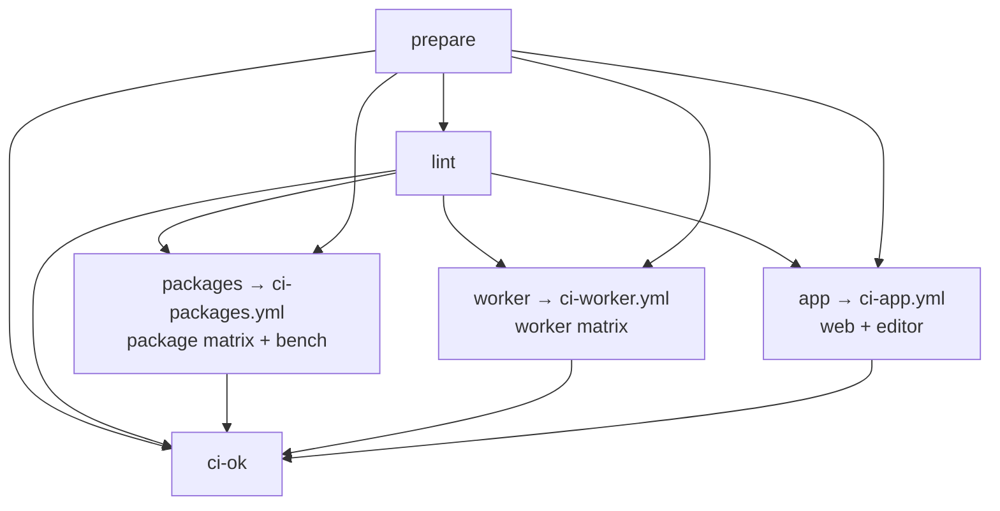

[← Workflows overview](./README.md)

# `ci.yml` - CI

Entry workflow for the monorepo. A `prepare` job detects everything once, `lint` covers the
workspace, and each area's jobs run through a called workflow of its own. `ci-ok` is the single
status check used for branch protection.

```yaml
on:
  push: { branches: [main] }
  pull_request:
concurrency:
  group: ${{ github.workflow }}-${{ github.ref }}
  cancel-in-progress: true # supersede stale runs on the same ref
```

| Field       | Value                                                                            |
| ----------- | -------------------------------------------------------------------------------- |
| Triggers    | `push` to `main`, every `pull_request`                                           |
| Permissions | declared per job, never workflow-wide - `ci-ok` takes `{}`, the rest the minimum |
| Concurrency | one run per `workflow + ref`; in-progress runs are cancelled                     |

---

## Job graph


```mermaid
flowchart TD
    prepare --> lint
    lint --> packages["packages → ci-packages.yml<br/>package matrix + bench"]
    lint --> worker["worker → ci-worker.yml<br/>worker matrix"]
    lint --> app["app → ci-app.yml<br/>web + editor"]
    prepare --> packages
    prepare --> worker
    prepare --> app
    prepare --> ciok["ci-ok"]
    lint --> ciok
    packages --> ciok
    worker --> ciok
    app --> ciok
```

`prepare`, `lint` and `ci-ok` live here; every other job lives in the workflow its caller job
names, and only runs when its area changed (see [`prepare`](#job-prepare)). `ci-ok` runs
`if: always()` so it can turn skips into a pass and real failures into a fail - a caller job whose
inner jobs all skipped reports `skipped`, and a failure anywhere inside it propagates out.

**A file per area, because the gate cannot be narrower than the file.** While one workflow held
every area's jobs, editing it could only mean "everything"; now each file says what it validates
and a one-line change to how the editor runs its tests re-runs the editor. See
[what a workflow validates](#what-a-workflow-validates).

---

## Job: `prepare`

`runs-on: ubuntu-latest` · `timeout-minutes: 15`. Produces every output the other
jobs consume via `needs.prepare.outputs.*`.

| #   | Step                          | Run / Action                                                                                                           | What it does                                                                                                                                                                                                                                                                                                                                                                                                                                                                                                                        |
| --- | ----------------------------- | ---------------------------------------------------------------------------------------------------------------------- | ----------------------------------------------------------------------------------------------------------------------------------------------------------------------------------------------------------------------------------------------------------------------------------------------------------------------------------------------------------------------------------------------------------------------------------------------------------------------------------------------------------------------------------- |
| 1   | Checkout Repository           | `actions/checkout@v7` (`persist-credentials: false`)                                                                   | Clone the repo without leaving the token on disk.                                                                                                                                                                                                                                                                                                                                                                                                                                                                                   |
| 2   | Read Node.js version          | `cat .nvmrc` → `$GITHUB_OUTPUT`                                                                                        | Single source of truth for the Node version; never hard-coded.                                                                                                                                                                                                                                                                                                                                                                                                                                                                      |
| 3   | Detect package manager        | shell `if` on lockfile presence                                                                                        | Emits `manager` (`pnpm`/`yarn`/`npm`), `command` (e.g. `install --frozen-lockfile --ignore-scripts` - no lifecycle script runs at install anywhere in CI), `runner`. Fails if none found.                                                                                                                                                                                                                                                                                                                                           |
| 4   | Read Playwright version       | `node -p "...devDependencies?.['@playwright/test'] \|\| ...dependencies?.['@playwright/test']"` then strip leading `^` | Feeds the Playwright binary cache key. **Must read `@playwright/test`** - the project has no bare `playwright` dep, so reading `playwright` yields the string `"undefined"` and freezes the cache key (see [Caching](#caching)).                                                                                                                                                                                                                                                                                                    |
| 5   | Discover workspace entities   | `node scripts/assemble-changes.mjs filters`                                                                            | Builds a per-entity `paths-filter` config: one key per app (`app__<name>`), worker (`worker__<name>`), package (`pkg__<name>`), CI definition file (`wf__<name>` - every workflow, plus `wf__actions-setup` for the [setup action](#the-setup-action)), and **one per root file** (`root__lock`, `root__workspace`, `root__package`, `root__nvmrc`, `root__tsconfig`) plus `ci__any` over every CI path and `ci__deleted` matching only CI-path deletions (see below) - a whitelist, so root docs/tooling dotfiles trigger nothing. |
| 6   | Detect changed entities       | `dorny/paths-filter@v4`                                                                                                | Consumes the generated `filters` (JSON is valid YAML) and outputs a `changes` list of the keys that matched, plus - via `list-files: json` - the matched paths per key; assemble reads `ci__any`'s list.                                                                                                                                                                                                                                                                                                                            |
| 7   | Copy base manifest + lockfile | `git show "$BASE_SHA:..."` into `$RUNNER_TEMP/base`, fetching one commit deep first if the shallow clone lacks it      | Hands the next step the two files it compares against. Every command may fail without failing the job - a missing or empty copy reads as "cannot be compared", which validates everything.                                                                                                                                                                                                                                                                                                                                          |
| 8   | Assemble `changes.json`       | `node scripts/assemble-changes.mjs assemble`                                                                           | Writes [`changes.json`](#changesjson) (the lists + `root`), and derives this run's own gating outputs `web` / `editor` / `has_packages` / `changed_packages` / `has_workers` / `changed_workers`. Root files are attributed first - see [What a root change means](#what-a-root-change-means). A whole-workspace root file, or a change to `ci.yml` itself, means every job runs.                                                                                                                                                   |
| 9   | Upload `changes.json`         | `actions/upload-artifact@v7` (name `changes`)                                                                          | Hands the single file to the CD workflows, which run on `workflow_run` and have no diff base of their own.                                                                                                                                                                                                                                                                                                                                                                                                                          |

### Outputs

| Output                                 | Meaning                                                                 |
| -------------------------------------- | ----------------------------------------------------------------------- |
| `node_version`                         | from `.nvmrc`                                                           |
| `manager` / `command` / `runner`       | package-manager triple                                                  |
| `playwright_version`                   | `@playwright/test` semver (cache key input)                             |
| `web` / `editor`                       | `'true'` when that app, a package it declares, or infra changed         |
| `has_packages` / `has_workers`         | `'true'` when ≥1 package / worker (or infra) changed                    |
| `changed_packages` / `changed_workers` | `fromJSON`-ready matrices `{include:[{area,dir,filter,flag,browsers}]}` |

**Who runs is derived, not listed.** A member runs when it changed, or when a package it declares
as a `workspace:` dependency changed - read from its own `package.json` rather than from a list
kept here. `workers/api` declares `schema` and `wrangler-tools`, `apps/web` declares the
design-system, `markdown`, `hooks` and `schema`; those edges reproduce the rules that used to be
hand-written, and stay right when a dependency moves. `eslint-config` is excluded: it is proved by
`lint`, not by re-running every consumer's suite.

`flag` is the unscoped package name, not the directory - two members are called `bench`, and their
flags are `bench` (the package) and `bench-api` (the worker). `browsers` marks a real-browser
vitest tier: it declares `playwright` and has no `test:e2e` script of its own, which is what tells
`packages/design-system` apart from the editor, whose Electron ships its own Chromium.

### `changes.json`

The single artifact the CD workflows consume. `apps` / `worker` / `packages` /
`workflows` are **lists of the changed names** (empty when nothing changed); `root`
is a **boolean** - a root change that means the **whole workspace**, not merely that a
top-level file was touched. No `dir`/`filter`/`flag` - a name is enough; each CD applies
its own [condition](./cd-web.md#job-changes).

A lockfile change is attributed, so `apps` / `packages` / `worker` can name a member whose
files were not themselves edited - adding a dependency to `apps/web` lists `web` here.

```json
{
  "apps": ["web"],
  "worker": ["api"],
  "packages": ["schema", "eslint-config"],
  "workflows": ["ci", "cd-web"],
  "root": false
}
```

### What a root change means

A root file used to mean "everything changed". Every dependency bump writes `pnpm-lock.yaml`,
so adding one dependency to one package paid for the entire matrix. Each root file is now asked
what it actually affects ([`scripts/assemble-changes.mjs`](../../scripts/assemble-changes.mjs)):

| Changed                                            | Means                                                                                                                        |
| -------------------------------------------------- | ---------------------------------------------------------------------------------------------------------------------------- |
| `pnpm-workspace.yaml` · `.nvmrc` · `tsconfig.json` | whole workspace - they change how everything installs and builds                                                             |
| root `package.json`                                | whole workspace **only** when something outside `scripts` changed (devDependencies, `pnpm` config, `engines`)                |
| `pnpm-lock.yaml`                                   | the members whose **importer** entry moved; the root importer `.`, or a change that moves no importer, means whole workspace |
| `.github/workflows/ci.yml`                         | whole workspace - it decides how every job runs, and this run is the proof                                                   |
| any other workflow                                 | nothing - CI never executes a deploy, Chromatic or the issue labeller, so running the workspace proves nothing about them    |
| `labs/*` (lockfile importer)                       | nothing - a bench experiment with no lint, no tests and no job                                                               |

The lockfile is compared **structurally**: its `importers:` blocks are sectioned by indentation and
matched key by key against the same file at the base commit. A changed importer's inner lines carry
no key of their own, so a diff hunk cannot say whose dependency moved - the block it sits in can.
It is sectioned rather than parsed because `prepare` runs before any install, so there is no YAML
parser to reach for, and pnpm writes the file itself.

Reading the base needs that commit, so the step before copies both files out of it: `BASE_SHA` is
the target branch for a pull request and the previous tip for a push, fetched one commit deep if the
shallow clone lacks it. That step is allowed to fail - reading is `git`'s job, deciding what it means
is the script's, and the script itself shells out to nothing.

**Anything that cannot be compared validates the whole workspace** - a missing base, an empty or
absent copy, a lockfile importer outside `apps/`, `workers/` or `packages/`. Each decision is logged
to the step's stderr (`changes: pnpm-lock.yaml moved app__editor`), so a surprising run says why it
happened.

Deliberately out of scope: tracing a transitive bump to the packages that depend on it. That needs
the resolved graph, and getting it wrong means skipping a package the bump did break.

---

## Job: `lint`

`needs: prepare` · ubuntu · 15 min. Lint + typecheck the whole workspace once
(`pnpm -r` skips workspaces without the script). Not change-gated - it's cheap.

| #   | Step         | Detail                                                                                   |
| --- | ------------ | ---------------------------------------------------------------------------------------- |
| 1   | Checkout     | `actions/checkout@v7`, no persisted creds                                                |
| 2   | Setup        | [`./.github/actions/setup`](#the-setup-action) - pnpm, Node and the install, in one step |
| 3   | Format Check | `${runner} run format:check` (`oxfmt --check`)                                           |
| 4   | Lint         | `${runner} run lint` (`oxlint --deny-warnings`)                                          |
| 5   | Typecheck    | `${runner} run typecheck`                                                                |

---

## The caller jobs

Each area's jobs live in a workflow of its own, called from here:

| Caller job | Calls                                                                                                      | Gated on          |
| ---------- | ---------------------------------------------------------------------------------------------------------- | ----------------- |
| `packages` | [`ci-packages.yml`](./ci-packages.md) - the package matrix + `bench`                                       | `has_packages`    |
| `worker`   | [`ci-worker.yml`](./ci-worker.md) - the worker matrix                                                      | `has_workers`     |
| `app`      | [`ci-app.yml`](./ci-app.md), which calls [`ci-web.yml`](./ci-web.md) and [`ci-editor.yml`](./ci-editor.md) | `web` or `editor` |

They are **called**, not triggered separately, because `needs:` cannot cross workflow files and
`ci-ok` has to keep seeing every job. Calling them keeps one run, one CI-environment approval wave
and one required check - and gives each area a file whose own marker says what editing it re-runs.

Three things about a caller job that are easy to get wrong:

- It cannot declare `environment:`, `timeout-minutes:`, `runs-on:` or `env:` - those belong to the
  jobs inside the called workflow. Its `permissions:` is a **ceiling**, so `packages` grants
  `pull-requests: write` for `bench` while the matrix rows re-declare `contents: read`.
- **`secrets: inherit` is mandatory, not stylistic.** `CODECOV_TOKEN` is scoped to the `CI`
  environment; naming it explicitly at the call site evaluates it in this workflow's
  environment-less context and passes an empty string - a green upload step that uploads nothing.
- Check names become `caller / called-job` (`web / e2e (chromium)`). Only `ci-ok` is required, and
  it stays a top-level job here, so branch protection is unaffected.

### The setup action

Every job that installs starts the same way, so the shared part lives in one composite action -
[`.github/actions/setup`](../actions/setup/action.yml):

```yaml
- name: Checkout Repository
  uses: actions/checkout@v7
  with:
    persist-credentials: false

- name: Setup pnpm, Node and dependencies
  uses: ./.github/actions/setup
  with:
    node_version: ${{ inputs.node_version }}
    manager: ${{ inputs.manager }}
    command: ${{ inputs.command }}
```

**Start a new job from that block.** Bumping the `pnpm/action-setup` pin or changing the store
cache is then an edit to one file, rather than one per job with a file left behind.

Two things it deliberately does not do:

- **It does not check out.** A local action is resolved from the working tree, so the checkout that
  puts it there cannot live inside it. The job keeps its own - which is also the step that varies:
  `ci-web.yml`'s `web` job needs `fetch-depth: 0` for Codecov base detection.
- **It does not cache per area.** Playwright binaries and the Electron binary stay in the jobs that
  want them, restored just after the call - nothing writes those paths during an install, and the
  restores only have to precede the steps that read them.

It carries a `# ci:validates all` marker of its own, so editing it re-runs every job. That is the
CI-side `all` and not a root change: `changes.root` stays false, and nothing deploys.

### What a workflow validates

Every workflow - and the setup action - declares its own scope on line 1, read by
[`scripts/assemble-changes.mjs`](../../scripts/assemble-changes.mjs):

```yaml
# ci:validates app__web
```

| Marker                          | Means                                                            |
| ------------------------------- | ---------------------------------------------------------------- |
| `all`                           | the whole workspace - `ci.yml`, which decides how every job runs |
| `nothing`                       | nothing - a `cd-*`, Chromatic, the labeller: CI never runs them  |
| `pkg__*` `worker__*` `app__web` | those members; `*` expands to every member of that area          |

The scope lives in the file whose jobs it describes, rather than in a table kept somewhere else -
so moving a job between files means editing the marker you were already editing. A workflow with
no marker, or one carrying a token the parser doesn't recognise, means the **whole workspace**: an
unreadable claim must over-run, never quietly under-run. The marker line holds tokens only; prose
goes on the line below, because a trailing "...and nothing else" is enough to make a file claim it
validates nothing.

A CI file that carries no key of its own - a **deleted** workflow (the keys are built from the
working tree, so the one thing that changed generates nothing to match), or an aux file no filter
names - cannot make a claim. So `prepare` compares paths, not keys: paths-filter lists every file
`ci__any` matched (`list-files: json`), and assemble subtracts the keyed files and the `.md`
companions, which are documentation no job reads. Anything left validates the whole workspace
instead of passing as "nothing changed" - even beside an edit whose own claim would otherwise
mask it, since from matched keys alone that mix looks exactly like the edit by itself. A file
list that fails to arrive counts as "everything" too, and the `ci__deleted` status predicate
(`deleted:` over the same two globs) backs the deletion case up independently of the list.

This attribution gates jobs and **never reaches `changes.json`**. Editing `ci-web.yml` must re-run
the web suite without shipping the site - and `cd-web.yml` deploys on `changes.apps` containing
`web`.

---

## Job: `ci-ok`

`if: always()` · `needs: [prepare, lint, packages, worker, app]` · ubuntu · 5 min.
The single required check for branch protection - **every job belongs in that list**.

```yaml
- if: contains(needs.*.result, 'failure') || contains(needs.*.result, 'cancelled')
  run: exit 1
```

Skipped change-gated jobs report `skipped` (not `failure`/`cancelled`), so a
package-only PR still passes `ci-ok` without the web suite ever running.

---

## Caching

Two independent caches; both are keyed so a real change busts them.

### 1. Dependency store (`actions/setup-node`)

Set once, in [the setup action](#the-setup-action): `setup-node@v7` with
`cache: ${{ inputs.manager }}`. For pnpm this caches the **pnpm store**, keyed
automatically off the `pnpm-lock.yaml` hash. A lockfile change → new key → fresh
install; otherwise the store is restored and `--frozen-lockfile` just links.

### 2. Playwright browser binaries (browser-tier package rows, `web`, `e2e`)

```yaml
env:
  PLAYWRIGHT_BROWSERS_PATH: ${{ github.workspace }}/ms-playwright
# restore (after the setup action installed - nothing writes this path during an install)
- uses: actions/cache/restore@v5
  id: playwright-cache
  with:
    path: ${{ github.workspace }}/ms-playwright
    key: ${{ runner.os }}-playwright-${{ needs.prepare.outputs.playwright_version }}
# ... then on a miss `playwright install --with-deps`,
#   on a hit `playwright install-deps` (Linux only) ...
# save (only on a miss, even if later steps fail)
- uses: actions/cache/save@v5
  if: always() && steps.playwright-cache.outputs.cache-hit != 'true'
  with:
    path: ${{ github.workspace }}/ms-playwright
    key: ${{ runner.os }}-playwright-${{ needs.prepare.outputs.playwright_version }}
```

Why the **restore/save split** instead of a single `actions/cache`:

- The download is guarded on the cache result: on a **miss**, `playwright install
--with-deps` fetches the browser binaries (and Linux system deps); on a **hit**, the
  binaries are already restored, so we run only `playwright install-deps` on Linux
  (apt libs live outside the cache) and skip installation entirely on Windows/macOS.
- `save` runs only on a miss (`cache-hit != 'true'`) and with `if: always()`, so a
  freshly downloaded set is persisted even if a later test step fails.

**Key correctness:** the key embeds `playwright_version`. That value comes from
`prepare` reading `@playwright/test` - the package actually in `apps/web/package.json`.
Reading a bare `playwright` (absent) returns `"undefined"`, which pins the key to
`<os>-playwright-undefined` forever: after the first save it always hits, so a
Playwright upgrade silently reuses stale browser binaries. Keying on the real version
makes an upgrade produce a new key and a fresh download.

---

See also: [cd-web.md](./cd-web.md), [cd-worker-api.md](./cd-worker-api.md), and the
[overview README](./README.md).
