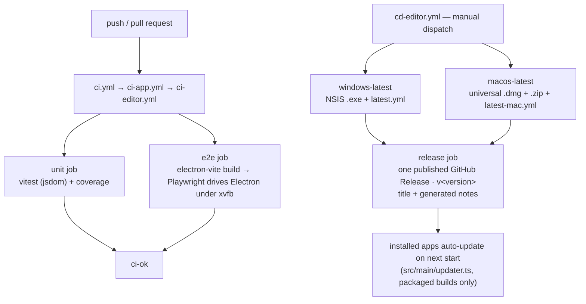
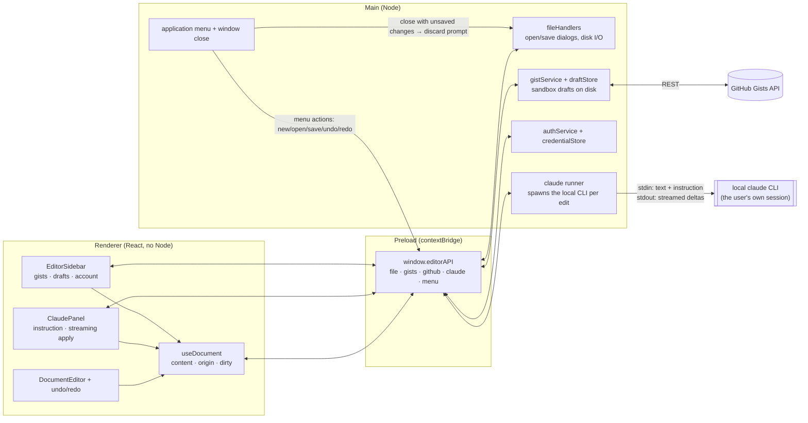

# `@soroush/editor` — desktop markdown editor

An Electron app for writing markdown: documents live on disk or as GitHub
gists (with an offline draft sandbox), and any selection — or the whole
document — can be rewritten by describing the change, which runs through the
**local `claude` CLI** using whatever account is signed in on the machine.
Built on `@soroush.tech/design-system` and `@soroush.tech/markdown`.

## Scripts

| Script               | What it does                                                      |
| -------------------- | ----------------------------------------------------------------- |
| `pnpm dev`           | electron-vite dev server with HMR                                 |
| `pnpm test`          | vitest unit/integration suites (jsdom, no Electron)               |
| `pnpm test:coverage` | the same with coverage — 100% is the bar                          |
| `pnpm test:e2e`      | builds the app, then Playwright drives the real Electron          |
| `pnpm dist`          | builds and packs the current platform's installer into `release/` |

## How the editor moves through CI and CD

CI validates every change twice — the jsdom suites and a Playwright run
against the real, built Electron app. Releasing is a separate, deliberate act:
approving a manual dispatch packs both platforms into one published release,
which is what puts the update in front of installed apps.

The deep dives live with the workflows:
[`ci-editor.md`](../../.github/workflows/ci-editor.md) ·
[`cd-editor.md`](../../.github/workflows/cd-editor.md).

## How events, the document, and Claude connect

Three processes, one typed bridge. The renderer never touches Node: everything
crosses `window.editorAPI`, the `contextBridge` surface the sandboxed preload
exposes, as `invoke`/`handle` pairs returning `{ success, data | error }`.
Application-level events flow the other way — the native menu and the window's
close button originate in main and are pushed to the renderer to act on.

An edit round-trip: the panel snapshots what was asked about, main spawns the
CLI, and every streamed delta is written straight into the document — guarded
so an answer only lands if the document is still the one it was asked about,
and a cancelled run can never write again. Saving a gist file stages into its
draft sandbox; nothing reaches GitHub until publish sends the draft whole.

## Conventions

Tests sit next to their source (`*.test.ts(x)` unit, `*.e2e.ts` Playwright,
shared e2e infra in `src/test/e2e/`), coverage is 100% on touched files, and
the security baseline is non-negotiable: `contextIsolation` + `sandbox`, no
`nodeIntegration`, CSP from response headers, raw `ipcRenderer` never exposed.
