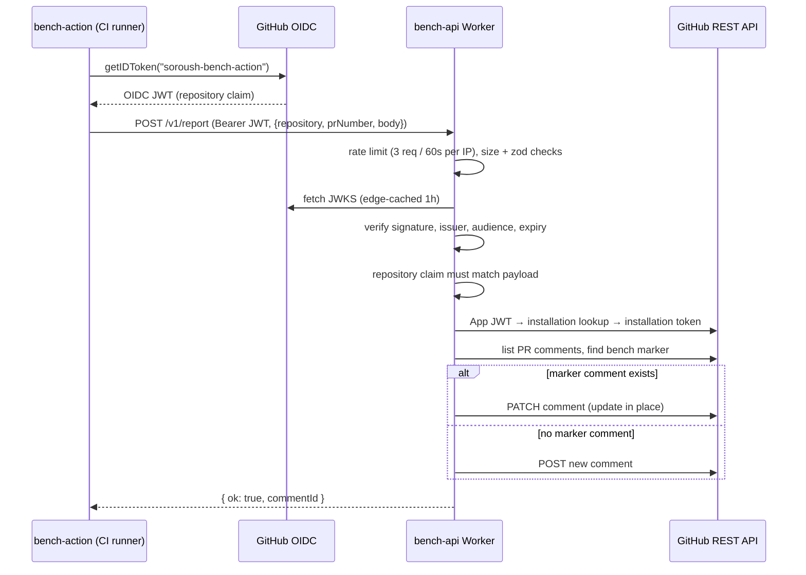

# @soroush/bench-api

The bench-action comment relay Worker (Hono) at `api.bench.soroush.tech`. It lets the
`soroush-tech/bench-action` CI step post its benchmark report as a **sticky PR comment authored
by the bench bot** — without any repo handing out a GitHub token. CI runners authenticate with
their short-lived GitHub Actions **OIDC JWT**; the relay verifies it, mints an installation
token for the bench GitHub App, and creates or updates the marker-matched comment on the PR.

## How a report flows

## Why a relay

A fork/public repo running the bench action has no secret it can safely use to comment on a PR.
The relay closes that gap with two trust anchors:

- **Caller identity** comes from the Actions OIDC token (issuer
  `token.actions.githubusercontent.com`, fixed audience `soroush-bench-action`), never from the
  payload. The payload's `repository` must equal the token's `repository` claim, so a caller can
  only ever post to its own repo.
- **Comment authority** comes from the bench **GitHub App**: the Worker authenticates as the
  App and exchanges an App JWT for an installation token scoped to that one repo. Repos the
  app is not installed on get a `404 App not installed` (the action's fallback signal).

The relay is deliberately not a general commenter: it only accepts bodies starting with the
hidden marker `<!-- soroush-bench-action -->`, and it upserts the single marker-matched comment
(update in place) instead of stacking a new comment per push.

## Routes

| Method | Path               | Purpose                                                              |
| ------ | ------------------ | -------------------------------------------------------------------- |
| `GET`  | `/v1/health`       | Liveness check → `200 { ok: true }` (rate-limit exempt).             |
| `POST` | `/v1/report`       | Verify OIDC, mint installation token, upsert the PR report comment.  |
| `GET`  | `/v1/docs`         | Swagger UI — **only when `DOCS_ENABLED=true`** (404 otherwise).      |
| `GET`  | `/v1/openapi.json` | OpenAPI 3.1 spec — same gate as `/v1/docs`; never set in production. |

`POST /v1/report` responses: `401` (missing/invalid OIDC token, repository mismatch), `400`
(bad JSON/payload), `413` (body over 64 KiB), `404` (app not installed on the repo), `429`
(rate-limited), `502` (GitHub API failure).

Unlike `@soroush/api` there is no CORS/origin guard — the callers are CI runners, not browsers.

## Bindings & config

`wrangler.json` is **generated from env** (see the `default.wrangler.json` template and
`scripts/gen-wrangler.mjs`) so no IDs land in the repo; `setup` (also run on `predev`/
`predeploy`) regenerates it. Bindings and vars:

- `RATE_LIMITER` — Workers rate-limit binding, 3 requests / 60s per IP (all routes except
  `/v1/health` and the docs routes).
- `BENCH_GH_APP_ID` — the bench GitHub App id (wrangler var; dev placeholder `0` in
  `default.env`, real id in the `cd-worker-bench` deploy environment).
- `DOCS_ENABLED` — serves the docs routes when `'true'`; local/preview only.

## Testing

`pnpm --filter @soroush/bench-api test:coverage` — the Hono app is exercised in-process via
`app.request()` with a stubbed `fetch` (JWKS, GitHub REST) and real WebCrypto signing/verifying;
100% coverage is required.
